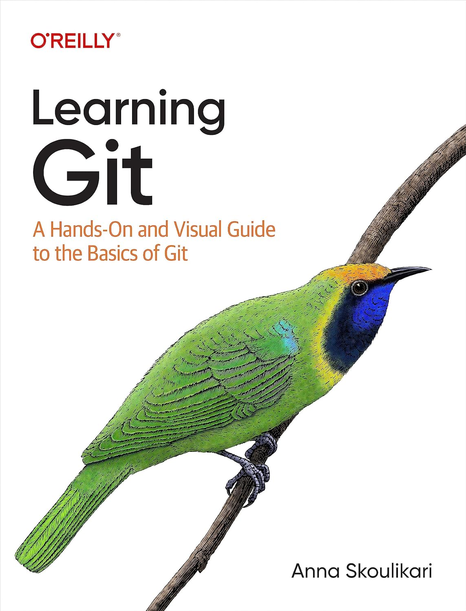

Hi, I'm **Daniel Corneschi**, a Linux systems engineer at **NTT Data**, based in **Romania**.

I work on infrastructure: Linux and Unix servers, networks, cloud and the automation that ties them together. Outside of work I run a homelab, which is where most of the ideas on this blog get tested before they are written down.

> Building reliable infrastructure through automation and best practices.

## What You'll Find Here

Practical notes on DevOps and infrastructure as code: how tools actually behave, the commands I use every day, and the details that are easy to forget. Every command in a post is run before it is published.

Topics I care about:

- **Infrastructure as code** with Terraform and Ansible
- **Containers and orchestration**: Docker, Kubernetes and Helm
- **Linux** and the command line
- **Homelab** design: building a resilient environment at home

## Certifications

- Red Hat Certified Engineer (RHCE)
- Cisco Certified Network Associate (CCNA)
- HashiCorp Certified: Terraform Associate
- AWS Certified SysOps Administrator – Associate
- Datadog Fundamentals
- IBM AIX
- HP-UX
- ITIL

## Currently Reading

## Get in Touch

- GitHub: [@dcorneschi](https://github.com/dcorneschi)
- If something here saved you some time, you can [buy me a coffee](https://www.buymeacoffee.com/dcorneschi).
