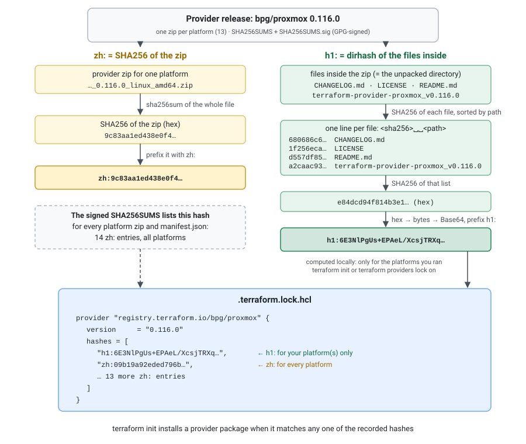

## Overview

The `.terraform.lock.hcl` file stores cryptographic hashes that verify the integrity of downloaded providers. Two hash schemes exist: `zh:` (a legacy scheme tied to zip archives) and `h1:` (a directory hash of the unpacked provider). Understanding how these are calculated helps when debugging lock file mismatches or verifying providers manually.

## zh and h1 Checksums

The `terraform init` command downloads the provider and verifies that it matches one of the checksums in the lock file, then extracts the package into `.terraform/providers`.

It also calculates a new `h1:` hash for that package, because Terraform has a "hash scheme upgrade" mechanism where it considers it safe to calculate a hash of a newer scheme if the package matches at least one hash of a legacy scheme. (`zh:` is a legacy scheme, usable only for `.zip` packages retrieved via the main registry protocol.)

- The `zh` is simply a SHA256 hash of the zip file which contains a provider for a specific OS/hardware platform combination.
- The `h1` hash is a so-called `dirhash` of the provider's directory (unzipped).

Both are **platform-specific**: the `linux_amd64` and `darwin_arm64` builds of the same provider version have different `zh:` and different `h1:` hashes.

The dirhash (`h1`) is created from the `sha256sum` output for all files. Once this list is sha256sum'd again, the resulting hash is taken in binary representation and then converted to Base64.


[](lock-file-hashes.svg "Open the diagram full size")

## Calculate h1 Hash

Navigate to the extracted provider directory and compute the hash step by step:

```sh
cd .terraform/providers/registry.terraform.io/bpg/proxmox/0.116.0/linux_amd64

ls -l
# total 28388
# -rw-r--r--. 1 root root   418150 Oct  7 02:36 CHANGELOG.md
# -rw-r--r--. 1 root root    16725 Oct  7 02:36 LICENSE
# -rw-r--r--. 1 root root    11117 Oct  7 02:36 README.md
# -rwxr-xr-x. 1 root root 28610722 Oct  7 02:41 terraform-provider-proxmox_v0.116.0
```

Generate the sha256 sums of all files, then hash that list:

```sh
sha256sum * > /tmp/dirhash

cat /tmp/dirhash
# 680686c64ef98748c8eb69dc7e84c1a1719b42f70037e11407f993b60b1a7ad6  CHANGELOG.md
# 1f256ecad192880510e84ad60474eab7589218784b9a50bc7ceee34c2b91f1d5  LICENSE
# d557df85f7fbec9d61307290372dc9a3856309af7baa4d9de5ac33d0949bb255  README.md
# a2caac93b94271e2a45289e0411c6959877afe489341957e518c5c8e5b181e45  terraform-provider-proxmox_v0.116.0

sha256sum /tmp/dirhash
# e84dcd94f814b3e10f01e2ff5dcb234d15ea407d64c1399a5bcc08f2476fecb3  /tmp/dirhash
```

> `sha256sum *` only works because this provider package is flat. For a package with subdirectories, every file has to be listed with its relative path (see the Go algorithm below).

Convert the hex hash to binary and then Base64-encode it:

```sh
echo e84dcd94f814b3e10f01e2ff5dcb234d15ea407d64c1399a5bcc08f2476fecb3 \
  | ruby -rbase64 -e 'puts Base64.encode64 [STDIN.read.chomp].pack("H*")'
# 6E3NlPgUs+EPAeL/XcsjTRXqQH1kwTmaW8wI8kdv7LM=
```

This matches the `h1:` entry in the lock file:

```hcl
# This file is maintained automatically by "terraform init".
# Manual edits may be lost in future updates.

provider "registry.terraform.io/bpg/proxmox" {
  version     = "0.116.0"
  constraints = "0.116.0"
  hashes = [
    "h1:6E3NlPgUs+EPAeL/XcsjTRXqQH1kwTmaW8wI8kdv7LM=",
    "zh:09b19a92eded796bc59de24f56201e2638fed28120add9b62a84fff0de859708",
    "zh:1991526fe4770293df35b800d1497792379a30670750e310dc669d7bf108eaf8",
    "zh:41d128e603e1eea60c1c8d50e81dc2e8fa9bd8000e882000b5e2b4753e9fcec5",
    "zh:6dc51173b5431a9bafb971bfb06a917bf0cd30a0129ffe1c26f6ba3f6938cf6f",
    "zh:785f677a6c17be7caa5dc86d291f391924696f826fb2356da1679d5e731657ae",
    "zh:79efe8cd66f4534f5fc1efbb99f968ee108033fd2c9d522369420c70b33467fd",
    "zh:80d2a81986735a457fe0cd3c0fb16f9af40c00e474732081fabc6a3bfca82e1a",
    "zh:871060b8b4f0e1b1ff83338da1c1a92e3c0b4c63ddb9d046b57d0a1a2bb86f48",
    "zh:88b67df96f2832d35366850a281d7eb468cc83cd2dd2afd662965ea042466897",
    "zh:9c83aa1ed438e0f4337bd4e05b35df55292f34d6b70aab906506e1594920811d",
    "zh:b4b197e81bb8fcef65640280f4380ece2103567443ea439181d40b018c11d7e7",
    "zh:ca5b1f77f3f1ccf78730548b4a94e1130fc239cd78af7365db705111160717da",
    "zh:d61c9da59c954a153e32cc0a2362f07a230aaddb12ea5ecd75e3ac52e3361ea1",
    "zh:f26e0763dbe6a6b2195c94b44696f2110f7f55433dc142839be16b9697fa5597",
  ]
}
```

Note the asymmetry: one `h1:` (only for the platform `terraform init` ran on) but fourteen `zh:` entries. Those come straight from the provider's signed `SHA256SUMS` file, which covers every platform the provider is built for (see [Where zh Hashes Come From](#where-zh-hashes-come-from)).


### Calculate h1 Without Ruby

Using `xxd` and `base64` instead of the Ruby one-liner:

```sh
cd .terraform/providers/registry.terraform.io/bpg/proxmox/0.116.0/linux_amd64

# Generate the sorted sha256sum list and hash it
sha256sum $(ls | LC_ALL=C sort) | sha256sum | awk '{print $1}' \
  | xxd -r -p | base64
# 6E3NlPgUs+EPAeL/XcsjTRXqQH1kwTmaW8wI8kdv7LM=
```

Or using Python:

```sh
sha256sum $(ls | LC_ALL=C sort) | sha256sum | awk '{print $1}' \
  | python3 -c "import sys,base64,binascii; print(base64.b64encode(binascii.unhexlify(sys.stdin.read().strip())).decode())"
# 6E3NlPgUs+EPAeL/XcsjTRXqQH1kwTmaW8wI8kdv7LM=
```

On macOS, `sha256sum` ships with recent releases; on older ones replace it with `shasum -a 256`, which prints the same format.


### Calculate h1 Directly From the Zip

Terraform doesn't need to unpack a provider to know its `h1:` hash. `terraform providers lock` downloads each platform's zip and hashes the files *inside* it. The same thing in Python, in any empty directory (`terraform init` deletes the zip after unpacking, so download it first):

```sh
curl -sLO https://github.com/bpg/terraform-provider-proxmox/releases/download/v0.116.0/terraform-provider-proxmox_0.116.0_linux_amd64.zip

python3 - terraform-provider-proxmox_0.116.0_linux_amd64.zip <<'EOF'
import sys, zipfile, hashlib, base64
z = zipfile.ZipFile(sys.argv[1])
lines = "".join(f"{hashlib.sha256(z.read(n)).hexdigest()}  {n}\n"
                for n in sorted(z.namelist()) if not n.endswith("/"))
print("h1:" + base64.b64encode(hashlib.sha256(lines.encode()).digest()).decode())
EOF
# h1:6E3NlPgUs+EPAeL/XcsjTRXqQH1kwTmaW8wI8kdv7LM=
```

This is why `h1:` doesn't care how the provider was delivered: the zip and the unpacked directory produce the same hash.


## How h1 Actually Works (Under the Hood)

Terraform's `h1:` hash is implemented using Go's [`golang.org/x/mod/sumdb/dirhash`](https://github.com/golang/mod/blob/master/sumdb/dirhash/hash.go) package — the same algorithm used by Go modules in `go.sum` files. Terraform calls `dirhash.HashDir()` for unpacked directories and `dirhash.HashZip()` for zip archives.

The algorithm (`Hash1`) works as follows:

1. List all files in the directory recursively
2. Sort the file list alphabetically
3. For each file, compute SHA256 of its content
4. Write a line in the format: `<hex-sha256>  <filename>\n` (two-space separator)
5. SHA256 the entire concatenated output from step 4
6. Base64-encode the final hash
7. Prefix with `h1:`

The Go implementation (simplified):

```go
func Hash1(files []string, open func(string) (io.ReadCloser, error)) (string, error) {
    h := sha256.New()
    files = append([]string(nil), files...)
    slices.Sort(files)
    for _, file := range files {
        r, _ := open(file)
        hf := sha256.New()
        io.Copy(hf, r)
        r.Close()
        fmt.Fprintf(h, "%x  %s\n", hf.Sum(nil), file)
    }
    return "h1:" + base64.StdEncoding.EncodeToString(h.Sum(nil)), nil
}
```

Key details:
- The hash covers **file paths and file contents** only — not permissions, timestamps, or other metadata
- File names are sorted using Go's default string sorting (lexicographic, byte-wise). Use `LC_ALL=C sort` if you reproduce it in the shell, so your locale can't reorder names
- The line format uses **two spaces** between hash and filename (matching `sha256sum` output format)
- An empty prefix is passed for provider directories, so file names are relative paths without a leading prefix

### How zh Works

The `zh:` scheme is simpler — it's a plain SHA256 of the `.zip` file:

```go
func PackageHashLegacyZipSHA(loc PackageLocalArchive) (Hash, error) {
    f, _ := os.Open(string(loc))
    defer f.Close()
    h := sha256.New()
    io.Copy(h, f)
    return HashSchemeZip.New(fmt.Sprintf("%x", h.Sum(nil))), nil
}
```

The result is `zh:` followed by the lowercase hex-encoded SHA256, which is designed to exactly match the format used in the provider's `SHA256SUMS` file.

### Hash Verification Logic

When Terraform verifies a package, it uses `PackageMatchesAnyHash` which:

1. Iterates through all hashes in the lock file for that provider
2. For `h1:` hashes — computes `dirhash.HashDir()` of the unpacked directory (cached after first computation)
3. For `zh:` hashes — computes SHA256 of the `.zip` archive (only works if the archive is still available)
4. Returns `true` if **any single hash** matches

This means Terraform does **not** require all hashes to match — just one. Unrecognized hash schemes (future-proofing for `h2:`, etc.) are silently skipped rather than causing errors.

Once a package matches, `terraform init` also *adds* any missing hashes it can vouch for. A lock file containing only the `h1:` for your platform comes back from `terraform init` with all fourteen `zh:` entries added from the registry's signed checksums.


## Where zh Hashes Come From

The `zh` entries can also be found in the provider's release within the `SHA256SUMS` file:

```sh
curl -sL https://github.com/bpg/terraform-provider-proxmox/releases/download/v0.116.0/terraform-provider-proxmox_0.116.0_SHA256SUMS
# d61c9da59c954a153e32cc0a2362f07a230aaddb12ea5ecd75e3ac52e3361ea1  terraform-provider-proxmox_0.116.0_darwin_amd64.zip
# 871060b8b4f0e1b1ff83338da1c1a92e3c0b4c63ddb9d046b57d0a1a2bb86f48  terraform-provider-proxmox_0.116.0_darwin_arm64.zip
# ...
# 9c83aa1ed438e0f4337bd4e05b35df55292f34d6b70aab906506e1594920811d  terraform-provider-proxmox_0.116.0_linux_amd64.zip
# 09b19a92eded796bc59de24f56201e2638fed28120add9b62a84fff0de859708  terraform-provider-proxmox_0.116.0_linux_arm.zip
# ca5b1f77f3f1ccf78730548b4a94e1130fc239cd78af7365db705111160717da  terraform-provider-proxmox_0.116.0_linux_arm64.zip
# f26e0763dbe6a6b2195c94b44696f2110f7f55433dc142839be16b9697fa5597  terraform-provider-proxmox_0.116.0_manifest.json
# ...
```

Each line is the SHA256 hash of a platform-specific zip archive. Terraform uses these to verify the downloaded zip before extraction. Every line ends up in the lock file, which is why there are 14 `zh:` entries: 13 platform zips **plus the `manifest.json`**, which isn't a provider package at all.

### Find Which Platform a zh Belongs To

The lock file doesn't say which `zh:` is which. Join it against `SHA256SUMS`:

```sh
curl -sL https://github.com/bpg/terraform-provider-proxmox/releases/download/v0.116.0/terraform-provider-proxmox_0.116.0_SHA256SUMS \
  | grep -Ff <(grep -o 'zh:[0-9a-f]*' .terraform.lock.hcl | cut -d: -f2) \
  | awk '{print $2}'
```

A `zh:` with no match in `SHA256SUMS` was not published by the provider author, and the lock file deserves a closer look.

### Verify a zh by Hand

```sh
curl -sLO https://github.com/bpg/terraform-provider-proxmox/releases/download/v0.116.0/terraform-provider-proxmox_0.116.0_linux_amd64.zip

sha256sum terraform-provider-proxmox_0.116.0_linux_amd64.zip
# 9c83aa1ed438e0f4337bd4e05b35df55292f34d6b70aab906506e1594920811d  terraform-provider-proxmox_0.116.0_linux_amd64.zip
```

That matches the `zh:9c83aa1e…` entry in the lock file.

### Verify the SHA256SUMS Signature

The checksums are only as trustworthy as the `SHA256SUMS` file itself. Terraform checks its GPG signature on download; you can do the same. The registry API returns the signing key:

```sh
REL=https://github.com/bpg/terraform-provider-proxmox/releases/download/v0.116.0
curl -sLO $REL/terraform-provider-proxmox_0.116.0_SHA256SUMS
curl -sLO $REL/terraform-provider-proxmox_0.116.0_SHA256SUMS.sig

curl -s https://registry.terraform.io/v1/providers/bpg/proxmox/0.116.0/download/linux/amd64 \
  | jq -r '.signing_keys.gpg_public_keys[0].ascii_armor' | gpg --import

gpg --verify terraform-provider-proxmox_0.116.0_SHA256SUMS.sig \
             terraform-provider-proxmox_0.116.0_SHA256SUMS
# gpg: Good signature from "Pavel Boldyrev ..." [unknown]
# gpg: WARNING: This key is not certified with a trusted signature!
```

The registry response names the key as `0B3405B36193A495`, the same ID `terraform init` prints ("self-signed, key ID 0B3405B36193A495"). The trust warning only means you haven't signed the key yourself. On older releases gpg may also say the key has expired; that's fine, the key was valid when the release was signed. The same registry response also has a `shasum` field, which should equal the `zh:` for that platform.


## Why zh Is Considered Legacy

The `zh:` scheme only works for `.zip` files downloaded through the main Terraform registry protocol. It cannot verify providers installed from:

- A local filesystem mirror
- A network mirror (non-registry)
- Providers built from source

The `h1:` scheme works regardless of how the provider was obtained because it hashes the unpacked directory contents, not the delivery format.


## Security Model

The hashes in the lock file protect against tampered downloads after the initial lock. However, the trust model relies on the first `terraform init` that wrote the lock file being performed in a trusted environment. Once hashes are recorded and committed to version control, subsequent runs verify integrity against those known-good values.

This means:
- The first `terraform init` is a trust-on-first-use (TOFU) operation
- After that, any alteration to the provider binary will be caught
- Signing verification (via the registry's GPG signatures) happens at download time, but the lock file itself stores only hashes, not signatures

### Lock File Tampering Risk

The lock file can contain **multiple** `h1:` and `zh:` hashes per provider (one per platform). Critically, the two hash types don't need to have any relationship to each other — Terraform only requires that the downloaded artifact matches *at least one* hash of either type.

This means an attacker who modifies a provider binary on disk could compute a new `h1:` hash for the tampered directory and add it alongside the legitimate hashes in the lock file. The existing hashes remain valid for other platforms, so the modification won't break anyone else's installation — it just silently allows the tampered binary.

**Mitigations:**

- Always commit `.terraform.lock.hcl` to version control
- Carefully review any diffs to the lock file — unexpected hash additions are a red flag. Every `zh:` should appear in the provider's signed `SHA256SUMS` ([see above](#find-which-platform-a-zh-belongs-to))
- Treat lock file changes in PRs with the same scrutiny as dependency upgrades
- Run `terraform init` only in trusted environments for the initial lock generation
- Use `terraform init -lockfile=readonly` in CI so pipelines can never rewrite the lock file ([see below](#enforce-the-lock-file-in-ci))


## Multi-Platform Hashes

By default, Terraform only records the `h1:` hash for your current platform. This causes problems in teams where developers use macOS locally but CI runs on Linux.

Add hashes for multiple platforms:

```sh
terraform providers lock \
  -platform=linux_amd64 \
  -platform=darwin_arm64 \
  -platform=darwin_amd64
# - Obtained bpg/proxmox checksums for linux_amd64; This was a new provider and the checksums for this platform are now tracked in the lock file
# - Obtained bpg/proxmox checksums for darwin_arm64; This was a new provider and the checksums for this platform are now tracked in the lock file
# - Obtained bpg/proxmox checksums for darwin_amd64; This was a new provider and the checksums for this platform are now tracked in the lock file
#
# Success! Terraform has updated the lock file.
```

This downloads the provider zip for each platform, computes its `h1:` hash, and writes them all to `.terraform.lock.hcl` alongside the `zh:` list. It doesn't need a prior `terraform init`, and it only adds the platforms you list: if your own platform isn't in the list, add it too. Commit the result so all team members and CI can verify their platform-specific download.


## Enforce the Lock File in CI

Add `-lockfile=readonly` to `terraform init` in pipelines. Terraform still verifies checksums, but fails instead of updating the lock file. A provider added to the configuration without updating the lock file fails the build:

```
Error: Provider dependency changes detected

Changes to the required provider dependencies were detected, but the lock
file is read-only. To use and record these requirements, run "terraform init"
without the "-lockfile=readonly" flag.
```

And so does a version constraint that the locked version no longer satisfies:

```
Error: Failed to query available provider packages

Could not retrieve the list of available versions for provider bpg/proxmox:
locked provider registry.terraform.io/bpg/proxmox 0.115.0 does not match
configured version constraint 0.116.0; must use terraform init -upgrade to
allow selection of new versions
```

Lock file changes then only arrive through a reviewed commit, never as a side effect of a pipeline run.


## Providers Mirror (Air-Gapped Environments)

For environments without internet access, use `terraform providers mirror` to pre-download providers for every platform you need:

```sh
terraform providers mirror \
  -platform=linux_amd64 \
  -platform=linux_arm64 \
  /path/to/mirror
```

This writes the zips plus two small JSON index files:

```
/path/to/mirror/registry.terraform.io/bpg/proxmox/0.116.0.json
/path/to/mirror/registry.terraform.io/bpg/proxmox/index.json
/path/to/mirror/registry.terraform.io/bpg/proxmox/terraform-provider-proxmox_0.116.0_linux_amd64.zip
/path/to/mirror/registry.terraform.io/bpg/proxmox/terraform-provider-proxmox_0.116.0_linux_arm64.zip
```

Then point Terraform at the mirror in `~/.terraformrc` (or a file named by `TF_CLI_CONFIG_FILE`):

```hcl
provider_installation {
  filesystem_mirror {
    path    = "/path/to/mirror"
    include = ["registry.terraform.io/*/*"]
  }
}
```

The lock file works the same way with mirrors — hashes are still verified against the recorded values. But a mirror has no signed `SHA256SUMS`, so a lock file **created** from a mirror gets only `h1:` hashes, and only for the current platform. Terraform warns about it:

```
Warning: Incomplete lock file information for providers

Due to your customized provider installation methods, Terraform was forced to
calculate lock file checksums locally for the following providers:
  - bpg/proxmox

The current .terraform.lock.hcl file only includes checksums for linux_arm64,
so Terraform running on another platform will fail to install these
providers.

To calculate additional checksums for another platform, run:
  terraform providers lock -platform=linux_amd64
(where linux_amd64 is the platform to generate)
```

Without internet access, `terraform providers lock` has to read from the mirror too:

```sh
terraform providers lock \
  -fs-mirror=/path/to/mirror \
  -platform=linux_amd64 \
  -platform=linux_arm64
```

This adds the `h1:` for each platform. It can't add `zh:` hashes, but it doesn't need to: one matching hash per platform is enough.


## Troubleshooting

### Hash Mismatch Error

When Terraform detects a mismatch, you'll see an error like:

```
Error: Failed to install provider

Error while installing bpg/proxmox v0.116.0: the current package for
registry.terraform.io/bpg/proxmox 0.116.0 doesn't match any of the checksums
previously recorded in the dependency lock file; for more information:
https://developer.hashicorp.com/terraform/language/files/dependency-lock#checksum-verification
```

Common causes:
- The lock file was generated on a different platform and lacks hashes for the current one (by far the most common)
- The provider binary was corrupted during download
- A network proxy or mirror is serving a different file

### Lock File Only Has Hashes for Another Platform

The hash *type* doesn't matter, the *platform* does. Testing on a `linux_arm64` machine:

| Lock file contains | `terraform init` |
|---|---|
| only `h1:` for linux_arm64 | ✅ installs, adds all `zh:` |
| only `zh:` for linux_arm64 | ✅ installs, adds `h1:` and the other `zh:` |
| `h1:` and `zh:` for linux_amd64 | ❌ checksum mismatch |

So "only `h1:` in the lock file" is not a problem by itself. It typically shows up after the lock was created from a mirror, and the actual failure is that the other platforms are missing. Add them:

```sh
terraform providers lock \
  -platform=linux_amd64 \
  -platform=darwin_arm64
```

### Regenerating a Corrupted Lock File

If the lock file is beyond repair, delete it and let `terraform providers lock` recreate it for all your platforms in one step:

```sh
rm .terraform.lock.hcl
terraform providers lock \
  -platform=linux_amd64 \
  -platform=darwin_arm64 \
  -platform=darwin_amd64
```

Review and commit the new lock file. Without version pins in `required_providers`, this can also pick *newer* provider versions than before, so check the `version` lines in the diff.


## Update Terraform Providers

```sh
terraform init -upgrade
```

- `-upgrade` ignores the **versions** recorded in `.terraform.lock.hcl` and picks the newest version allowed by the `version` constraints in `required_providers`.
- It then rewrites the lock file with the new version and its hashes. With `version = "~> 0.115"`, this moved `bpg/proxmox` from 0.115.0 to 0.116.0. A tighter `~> 0.115.0` only allows 0.115.x patch releases, so it stayed on 0.115.0.
- With an exact pin such as `version = "0.116.0"`, there's nothing to upgrade to: change the constraint first.
- The `h1:` hashes for other platforms are dropped: after the upgrade only the current platform's `h1:` is left, so run `terraform providers lock -platform=...` again.

> You should never directly modify the lock file.


## References

- [Terraform Dependency Lock File](https://developer.hashicorp.com/terraform/language/files/dependency-lock)
- [Lock and Upgrade Provider Versions](https://developer.hashicorp.com/terraform/tutorials/configuration-language/provider-versioning)
- [Version Constraints](https://developer.hashicorp.com/terraform/language/expressions/version-constraints)
- [Provider installation (CLI config)](https://developer.hashicorp.com/terraform/cli/config/config-file#provider-installation)
